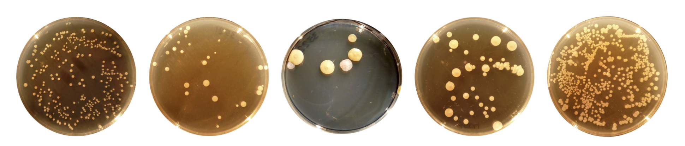
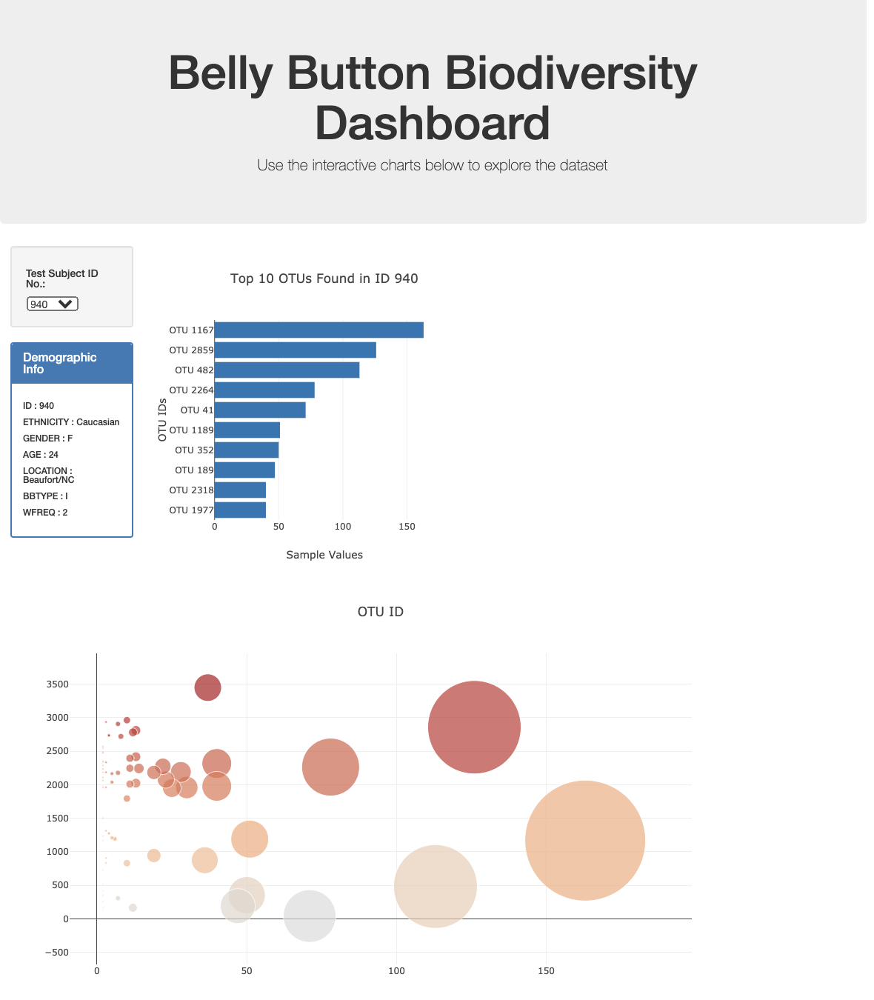
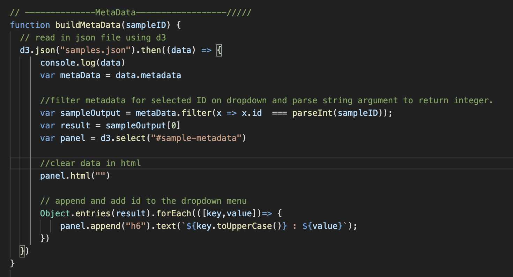
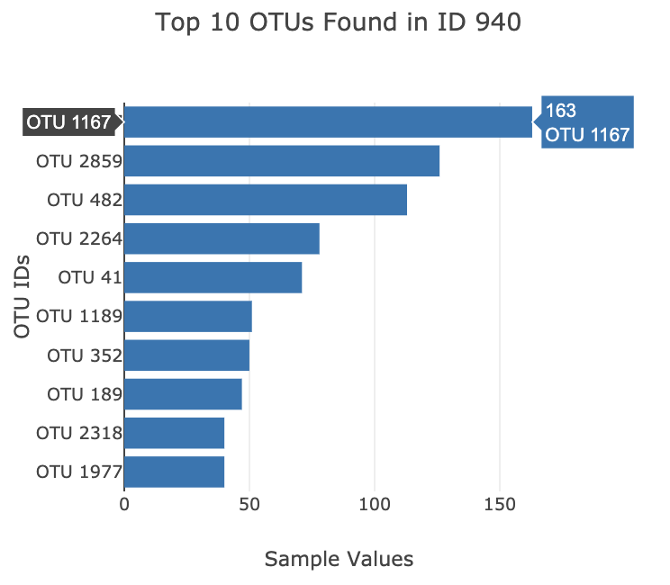
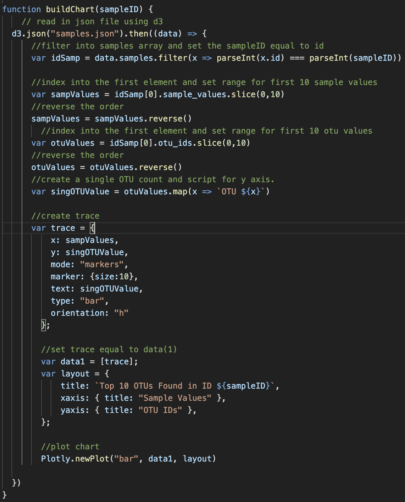
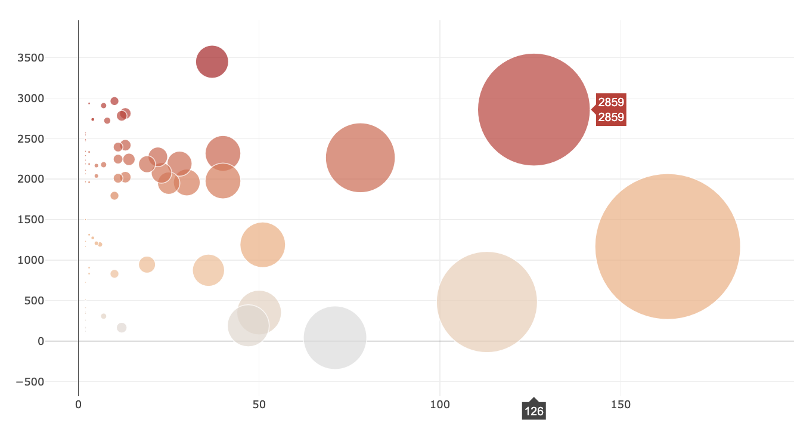
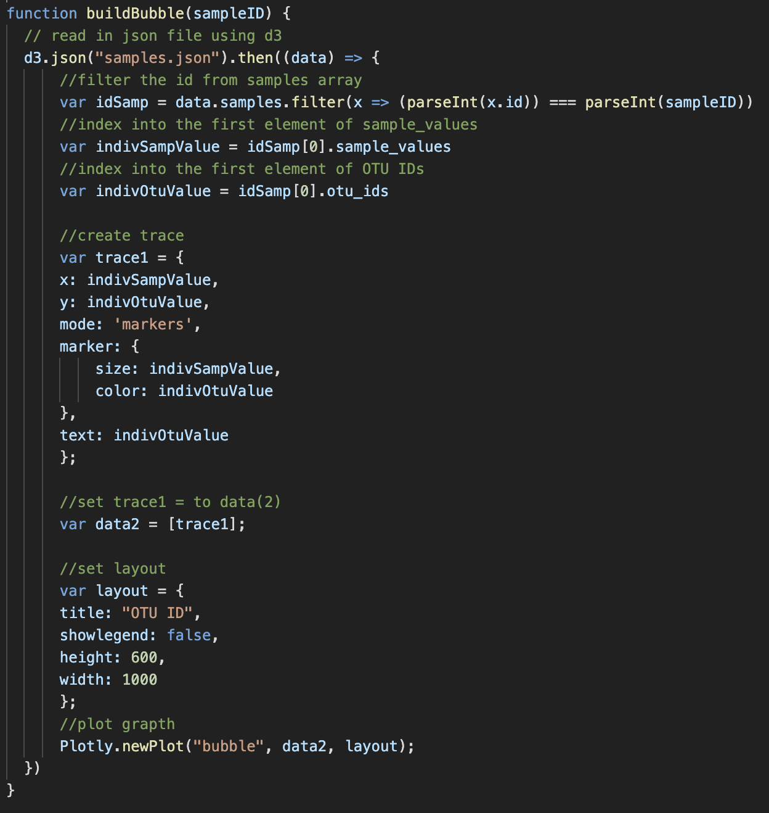
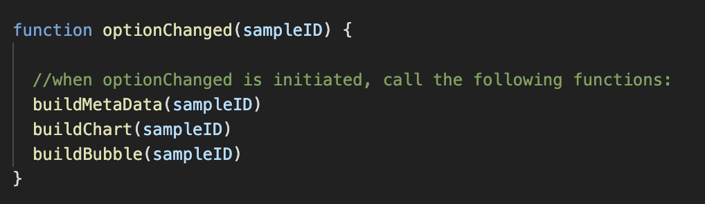
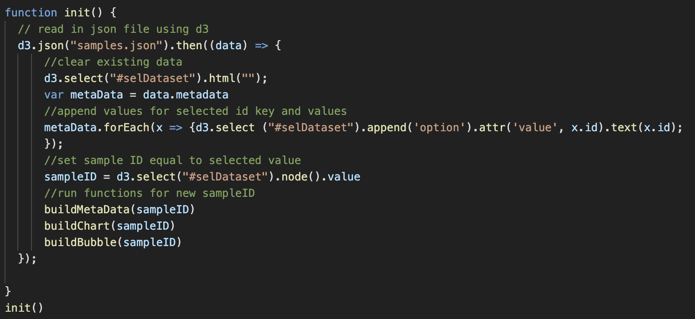

The following outlines how an interactive dashboard was built using Plotly and D3 to explore the Belly Button Biodiversity dataset, which catalogs the microbes that colonize human navels. 

The dashboard was deployed using Github Pages and can be found at https://cmdenys.github.io/plotly_challenge/
 

 
  <strong>The dashboard to the right is composed of three main components:</strong>
<ul>
  <li>A Bar Chart</li>
  <li>A Bubble Chart</li>
  <li>A Dropdown Menu</li>
</ul>

 
  
  

 
The first step in building the dashboard was to get the metadata needed to populate each component.  Since the file is JSON, D3 was used to read in the data for each function and the map function was used to filter the data for the object with the desired sample number.

Object.entries was then used to add each key and value pair and D3 was used again to append new tags for each of the key-value pairs in the metadata.

 
  

 
The first function created was called <strong>buildChart</strong>.  This function is used to create a bar chart which shows the top 10 OTU’s present in the selected sample ID.  When an OTU is hovered over, the OTU ID and count is displayed.  

 
  

 
The bar chart was created by filtering into the samples array and setting the sampleID equal to the ID found in the raw data.  Next, a range was set for the first 10 sample values and the first element was indexed into.  The same step was completed for the first 10 OTU values.  Then, a single OTU count and script was created for the y axis.  Finally, a trace was created and set equal to “data1” and a chart was plotted inside the div id “bar.

 
  

 
The next function created is called <strong>buildBubble</strong>, which displays all of the OTU’s found within a sample and uses size adjusting markers to highlight the volume present in each.  The x axis shows the count of OTU’s and the Y axis shows the OTU ID.  When the marker is hovered over, the corresponding data is displayed.

 
  

 
Using the SampleID created in the buildMetaData function, an idSamp variable was created by mapping into the id in the raw data and setting the requested sampleID equal to it.  Variables were then created for individual sample values and OTU’s, as well as a trace and layout.  Both the trace and layout were then plotted inside the div “bubble.” 

 
  
 

 
Following the bubble chart, the function <strong>optionChanged</strong> is used to call the functions above when a new ID is selected from the drop down menu.

 
  

 
Lastly, an initialization function <strong>init</strong> is used to clear existing data and append the values for new selected id key and values.  The Sample ID is set to the selected value and new charts are built.

 
  
